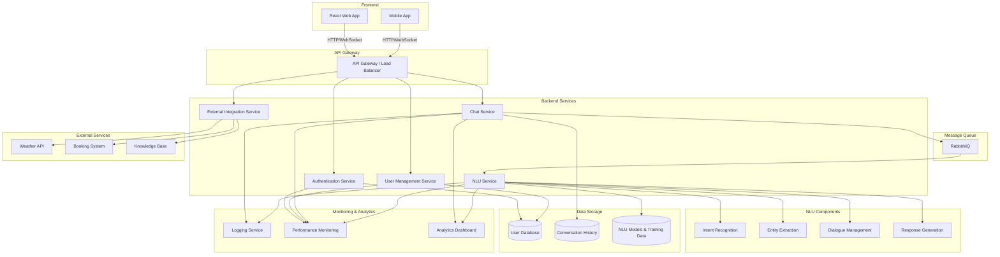

# Project

```mermaid
graph TD
    subgraph "Frontend"
        A[React Web App]
        B[Mobile App]
    end

    subgraph "API Gateway"
        C[API Gateway / Load Balancer]
    end

    subgraph "Backend Services"
        D[Authentication Service]
        E[User Management Service]
        F[Chat Service]
        G[NLU Service]
        H[External Integration Service]
    end

    subgraph "NLU Components"
        I[Intent Recognition]
        J[Entity Extraction]
        K[Dialogue Management]
        L[Response Generation]
    end

    subgraph "Data Storage"
        M[(User Database)]
        N[(Conversation History)]
        O[(NLU Models & Training Data)]
    end

    subgraph "Message Queue"
        P[RabbitMQ]
    end

    subgraph "External Services"
        Q[Weather API]
        R[Booking System]
        S[Knowledge Base]
    end

    subgraph "Monitoring & Analytics"
        T[Logging Service]
        U[Performance Monitoring]
        V[Analytics Dashboard]
    end

    A -->|HTTP/WebSocket| C
    B -->|HTTP/WebSocket| C
    C --> D
    C --> E
    C --> F
    C --> H

    F --> P
    P --> G

    G --> I
    G --> J
    G --> K
    G --> L

    D --> M
    E --> M
    F --> N
    G --> O

    H --> Q
    H --> R
    H --> S

    F --> T
    G --> T
    D --> U
    E --> U
    F --> U
    G --> U
    F --> V
    G --> V
```
